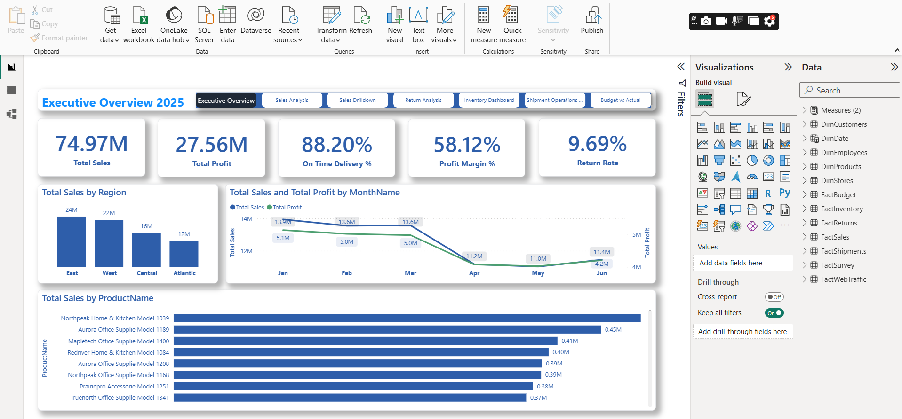
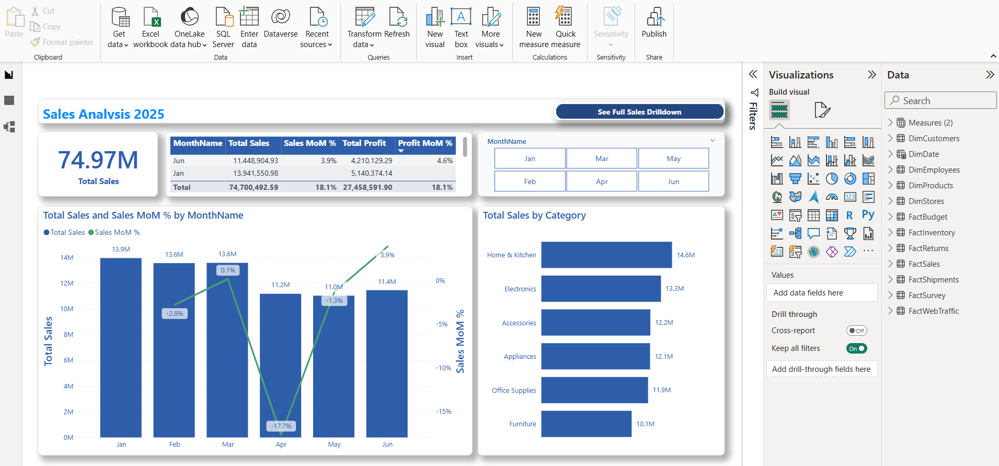
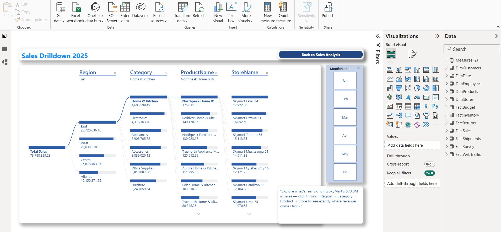
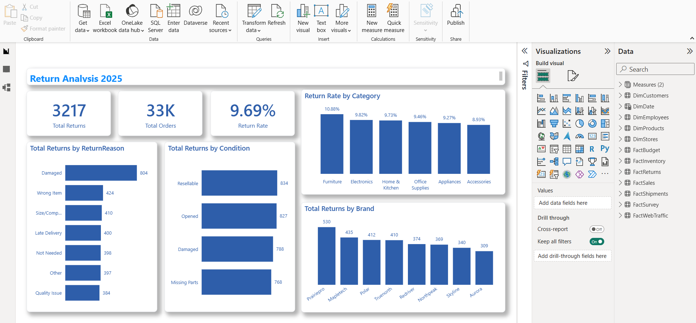
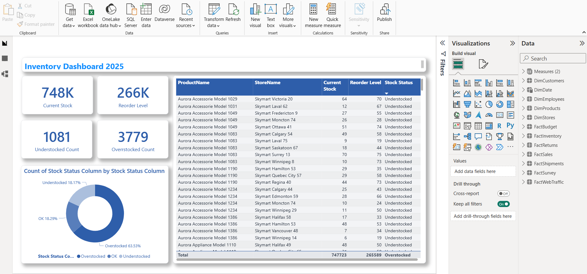
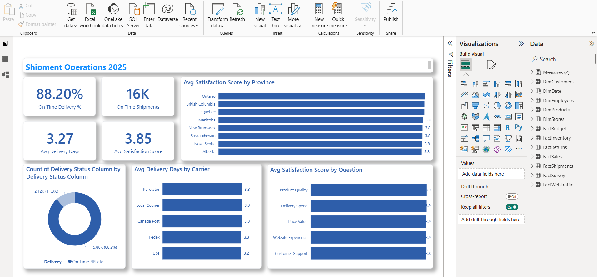
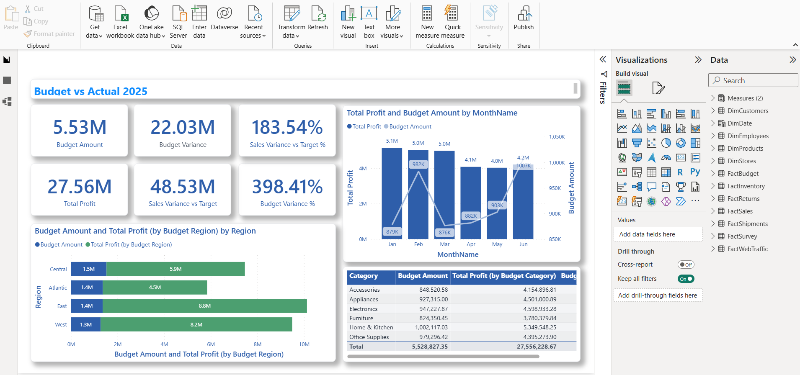

# SkyMart Power BI Dashboard

An end-to-end Business Intelligence project built in **Power BI Desktop**, using **Power Query** for data cleaning and **DAX** for analysis. Simulates a real BI analyst engagement for a fictional retailer, SkyMart, consolidating messy Excel/CSV exports into one trusted, interactive dashboard.

---

## 📌 Business Problem

SkyMart management needed one trusted BI dashboard because sales, returns, inventory, shipments, survey, and web traffic data all came from different, messy source files. This project acts as the BI analyst work of cleaning, transforming, modeling, and visualizing that data into a decision-ready report.

---

## ❓ Business Questions Answered

| # | Question | Report Page |
|---|---|---|
| 1 | Are sales and profit improving month over month? | Executive Overview, Sales Analysis |
| 2 | Which products, categories, stores, and regions drive revenue? | Sales Analysis, Sales Drilldown |
| 3 | Which products have high return rates and why? | Returns Analysis |
| 4 | Which items are understocked or overstocked? | Inventory Dashboard |
| 5 | Are shipments being delivered on time? | Shipment Operations |
| 6 | How does customer satisfaction differ by region? | Customer Satisfaction |
| 7 | Are actuals meeting budget targets? | Budget vs Actual |

---

## 📊 Report Pages & Observations

### 1. Executive Overview

Company snapshot: $74.97M Total Sales, $27.56M Total Profit, 9.69% Return Rate, 88% On-Time Delivery. Immediate sense of overall health at a glance.

### 2. Sales Analysis

Sales declined steadily from Jan ($13.9M) through Apr ($11.2M, -17.7% MoM), before recovering in May–Jun. Profit followed the same pattern, ending down 18.1% cumulatively. East region and the Skymart Laval/Ottawa/Toronto stores are the top revenue contributors.

### 3. Sales Drilldown

Interactive breakdown of the $73.8M revenue base: East leads all regions ($23.7M), Home & Kitchen is the top category ($4.6M), and Northpeak's top model alone drives $175K — click-through tool for tracing revenue to its source.

### 4. Returns Analysis

9.69% overall return rate across 3,217 returns. Furniture has the highest category return rate (10.9%); Prairiepro is the highest-return brand (530 returns). Most common reasons: Damaged (804) and Wrong Item (424); most returned items come back in Resellable or Opened condition.

### 5. Inventory Dashboard

63.5% of SKU-store combinations are Overstocked (3,779 records) — a significant excess-inventory signal worth investigating (tied-up capital, storage costs, risk of markdowns). 18.2% are Understocked (1,081 records) — these need restocking attention. 18.3% are within the OK range.

### 6. Shipment Operations & Customer Satisfaction

88.2% of shipments delivered on time (within 5 days of ship date), averaging 3.27 days overall. Carrier performance is fairly consistent, no single carrier standing out as a bottleneck.

Satisfaction is consistently high and stable across all provinces (3.8–3.9 out of 5). Customer Support scores marginally lower than Product Quality, Delivery Speed, Price Value, and Website Experience.

### 8. Budget vs Actual

Actual profit exceeded budget targets by ~398% across every month, region, and category — a consistent, dramatic overshoot worth flagging for the next budget planning cycle rather than a one-off anomaly.

*(Screenshots of every page are in `/screenshots`.)*

---

## 🔑 Key Insights

- **Sales declined Jan → Apr 2025, then recovered in May–Jun**, ending the period down overall for profit MoM.
- **East region** drives the most revenue ($23.7M), with **Home & Kitchen** the top category.
- **Furniture** has the highest return rate (10.9%); **Prairiepro** is the highest-return brand.
- **~63.5% of SKU–store combinations are currently overstocked — a significant excess-inventory signal (tied-up capital, storage costs). ~18% are understocked and need restocking attention.
- **88.2% of shipments arrive on time** (defined as within 5 days of ship date — no promised-date field existed in source data).
- **Customer satisfaction is consistently high (~3.8–3.9/5)** across all provinces and survey categories.
- **Actual profit exceeded budget targets by ~398%** across all months/regions/categories — flagged as a planning-assumption finding, not a data error (see `data_quality_notes.md`).

---

## 🛠️ Tools & Techniques

- **Power Query:** folder-based append, merges/joins across 10+ tables, text cleaning (trim/clean/casing), mixed-date-format parsing, duplicate/blank handling, column splitting, unpivoting survey data.
- **Data Modeling:** star schema, Date table with hierarchy, many-to-many relationship with `USERELATIONSHIP()` for cross-fact filtering (Budget ↔ Sales).
- **DAX:** 25+ measures covering revenue, profit, margin, MoM trend, return rate, stock status, delivery performance, satisfaction, and budget variance. Full list in `DAX_measures.md`.
- **Report Design:** custom theme, consistent KPI/chart/table layout across pages, decomposition tree, conditional formatting, page navigation buttons.

---

## 📁 Repo Structure

```
   skymart-powerbi-dashboard/
   ├── SkyMart_Dashboard.pbix
   ├── README.md
   ├── screenshots/
   ├── DAX_measures.md
   ├── data_quality_notes.md
   ├── SkyMart_Theme.Json
```

## 🚀 How to Use

📥 **[Download the Power BI file (SkyMart_Power_BI_Project.pbix)](SkyMart_Power_BI_Project.pbix)**


---

## 📄 License

MIT — feel free to reference the structure/approach for your own learning projects.
